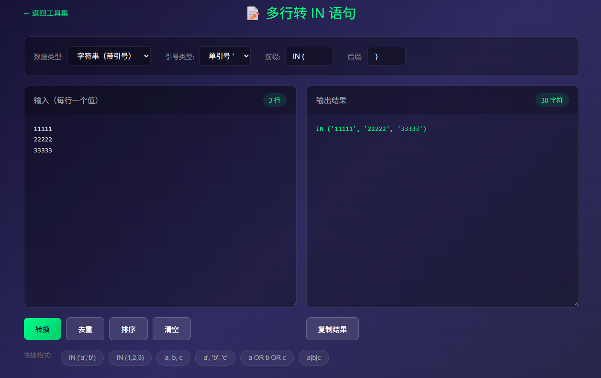
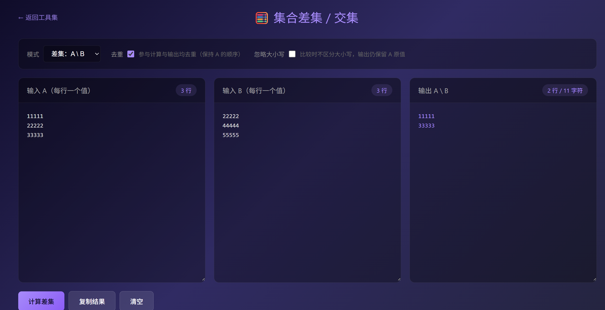

# 🛠️ Dev Toolkit - 开发者工具集

[](https://github.com/helloworldTXT/dev-toolkit)


**👉 [在线体验 / Live Demo](https://helloworldtxt.github.io/dev-toolkit/)**

一套轻量级的前端开发者工具集，**单文件 HTML 实现**，无需安装、无需依赖、离线可用。

## ✨ 特性

- 🚀 **零依赖** - 纯 HTML/CSS/JS，无需任何构建工具
- 📦 **单文件** - 每个工具都是独立的 HTML 文件，可单独使用
- 🌐 **离线可用** - 下载后无需网络即可使用
- 🎨 **暗色主题** - 护眼的深色 UI 设计

## 🧰 工具列表

| 工具 | 说明 | 文件 |
|------|------|------|
| **JSON 格式化** | JSON 格式化、压缩、校验，语法高亮，快速定位错误 | `json-formatter.html` |
| **时间戳转换** | Unix 时间戳与日期时间互转，支持秒级/毫秒级 | `timestamp.html` |
| **多行转 IN 语句** | 多行文本转 SQL IN 语句，支持字符串/数字格式 | `in-clause.html` |
| **集合差集/交集** | 两份列表对比，求差集(A\B)或交集(A∩B) | `set-diff.html` |

## 📸 截图预览

### 首页


### 多行转 IN 语句



### 集合差集/交集



## 🚀 使用方法

### 方法一：直接使用

1. 下载或克隆本仓库
2. 双击 `index.html` 在浏览器中打开
3. 选择需要的工具即可使用

### 方法二：单独使用某个工具

每个工具都是独立的 HTML 文件，可以单独下载使用：

```bash
# 只下载 JSON 格式化工具
curl -O https://raw.githubusercontent.com/helloworldTXT/dev-toolkit/main/json-formatter.html
```

## 📁 项目结构

```
dev-toolkit/
├── index.html          # 工具集首页
├── json-formatter.html # JSON 格式化工具
├── timestamp.html      # 时间戳转换工具
├── in-clause.html      # 多行转 IN 语句工具
├── set-diff.html       # 集合差集/交集工具
├── screenshots/        # 截图目录
│   ├── index.png
│   ├── in-clause.png
│   └── set-diff.png
└── README.md
```

## 📄 License

MIT License
